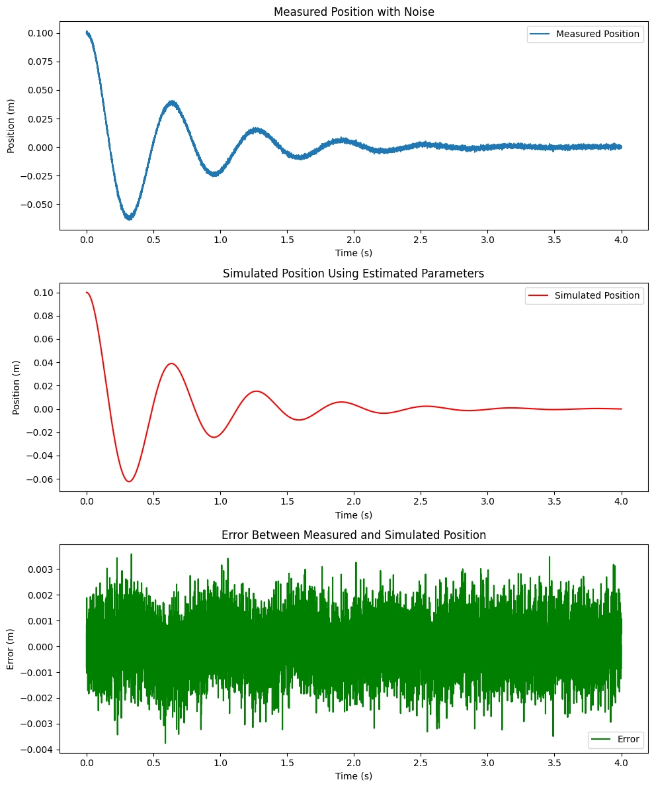

# ODE-fit

Damped Harmonic Oscillators: Parameter Estimation in SciPy

[Working notebook with results](<final ODE 2nd order.ipynb>)

[HTML -> Working notebook with results](<final ODE 2nd order.html>)
